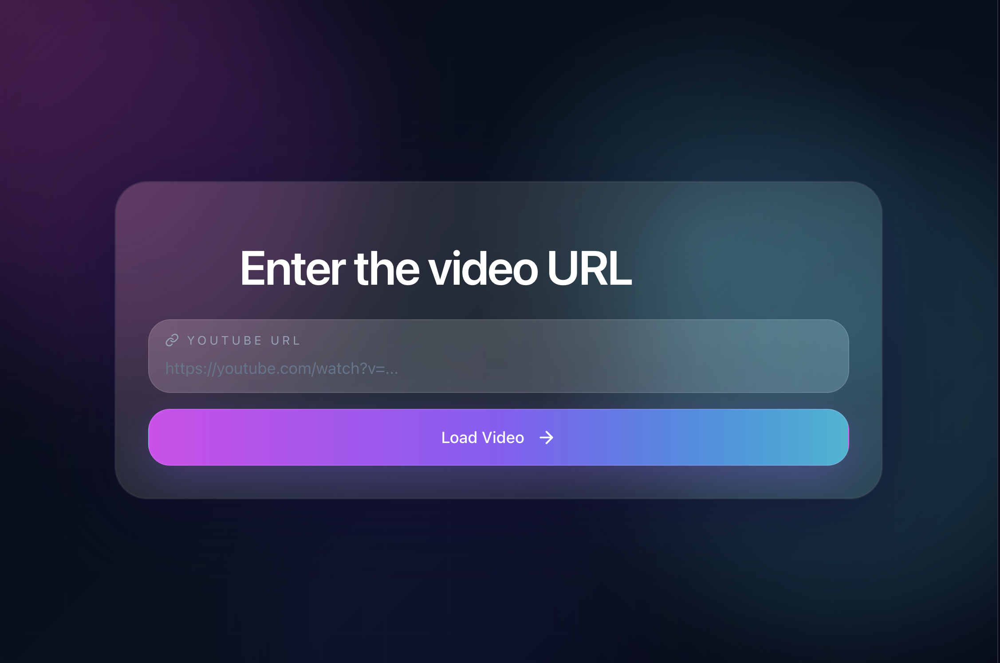

# YouTube Video Chatbot

A full-stack app to chat with a YouTube video's transcript using RAG.

- Frontend: React + Vite + TypeScript + Tailwind
- Backend: FastAPI + SentenceTransformers + FAISS
- Optional LLM: Groq (via `GROQ_API_KEY` + `GROQ_API_URL`)

## Project Structure

```text
Youtube-Bot/
  backend/
    main.py
    requirements.txt
    run_dev.sh
    test_client.py
  frontend/
    src/
    package.json
    .env.example
```

## Prerequisites

- Python 3.10+
- Node.js 18+
- npm

## 1) Backend Setup

```bash
cd backend
python -m venv .venv
source .venv/bin/activate
pip install -r requirements.txt
```

Optional Groq config:

```bash
export GROQ_API_KEY=your_key_here
export GROQ_API_URL=your_groq_endpoint_here
```

Run backend:

```bash
cd backend
./run_dev.sh
```

Backend will run on `http://127.0.0.1:8000`.

## 2) Frontend Setup

```bash
cd frontend
npm install
cp .env.example .env
npm run dev
```

Frontend will run on Vite dev server (usually `http://localhost:5173` or `http://localhost:5174`).

## API Endpoints

- `POST /load-video`
  - Body: `{ "youtube_url": "https://youtube.com/watch?v=..." }`
  - Response: `{ "session_id": "..." }`

- `POST /chat`
  - Body: `{ "session_id": "...", "question": "..." }`
  - Response: `{ "answer": "...", "source": "retrieval|groq" }`

## Notes

- CORS is enabled for local frontend ports (`5173` and `5174`).
- The backend builds a per-session FAISS index from transcript chunks.
- If Groq is not configured, the backend returns retrieval-grounded answers.

## Quick Test (Backend)

```bash
cd backend
source .venv/bin/activate
python test_client.py
```

## Deploying

### Backend on Render

1. Push this repository to GitHub.
2. In Render, create a new **Web Service** from the GitHub repo.
3. Use these settings:
  - **Root Directory**: `backend`
  - **Build Command**: `pip install -r requirements.txt`
  - **Start Command**: `uvicorn main:app --host 0.0.0.0 --port $PORT`
4. Add environment variables in Render:
  - `GROQ_API_KEY` if you want Groq generation
  - `GROQ_API_URL` for your Groq endpoint
  - `ALLOWED_ORIGINS` set to your Vercel URL, for example `https://your-app.vercel.app`
5. Deploy and copy the Render service URL.

### Frontend on Vercel

1. Create a new Vercel project from the same GitHub repo.
2. Set the **Root Directory** to `frontend`.
3. Vercel should detect Vite automatically:
  - **Build Command**: `npm run build`
  - **Output Directory**: `dist`
4. Add environment variable:
  - `VITE_API_BASE_URL` = your Render backend URL, for example `https://your-backend.onrender.com`
5. Deploy.

### After Deployment

- Make sure the frontend Vercel URL is included in `ALLOWED_ORIGINS` on Render.
- Make sure `VITE_API_BASE_URL` points to the Render backend URL.
- Test the full flow: load a YouTube URL, then chat.

## License

Add your preferred license here.
